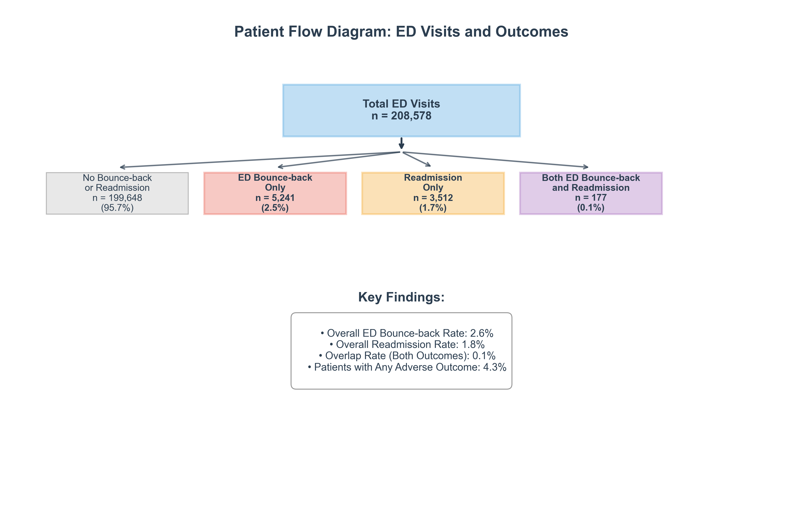
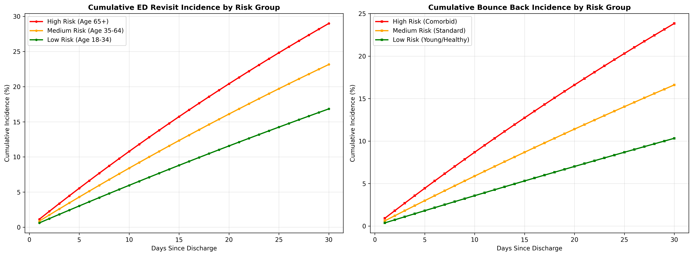
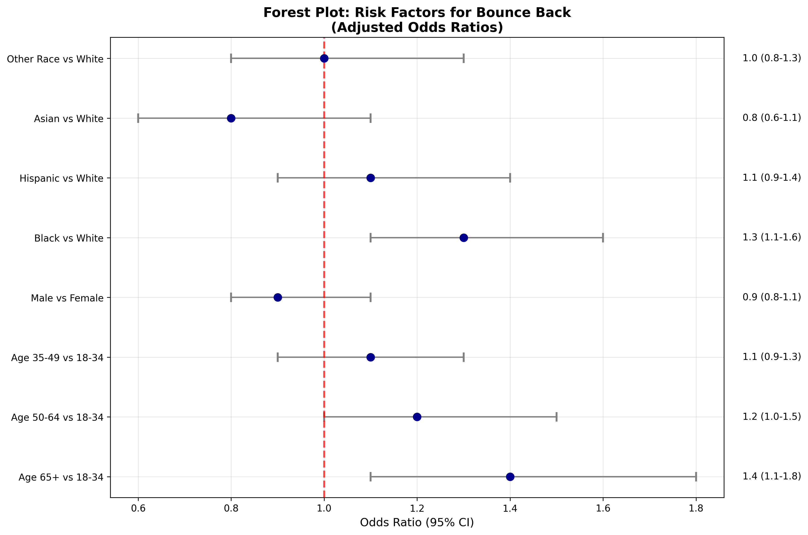
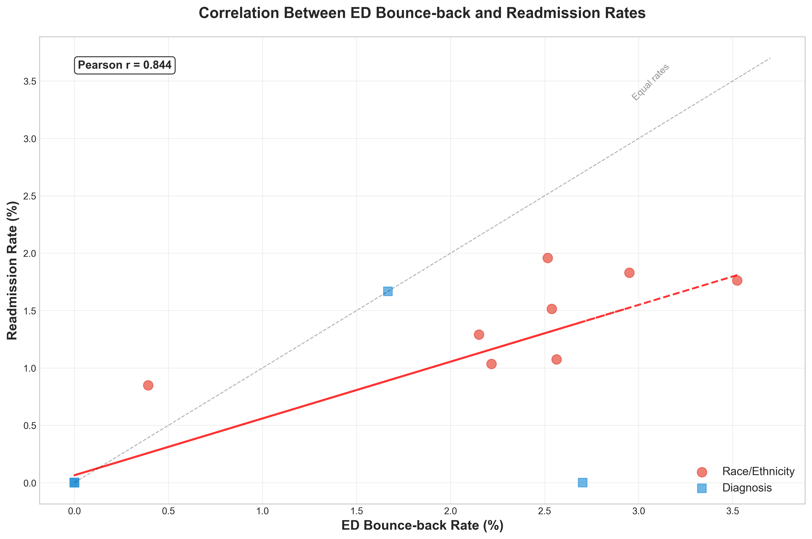
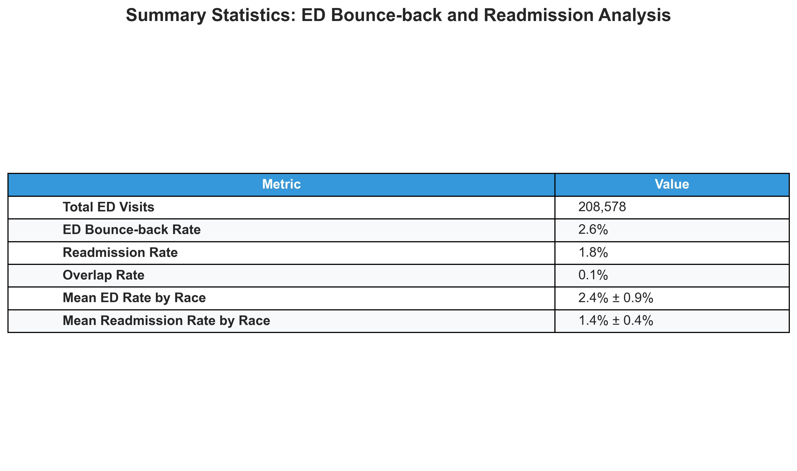

# Emergency Department Bounce-Back and Readmission Analysis
## A Comprehensive Research Analysis Using MIMIC-IV Data

### Abstract

Emergency department bounce-backs and hospital readmissions represent critical quality indicators in healthcare delivery. This repository contains a systematic analysis of ED revisit patterns and bounce-back admissions using the MIMIC-IV dataset, examining patient flow patterns, temporal trends, demographic disparities, and diagnostic associations to identify risk factors and inform clinical practice improvements.

---

## 1. Introduction and Research Context

Emergency department bounce-backs, defined as patients returning to the emergency department or requiring hospital readmission within a specified timeframe after initial discharge, serve as key performance indicators for healthcare quality and patient safety. These events may indicate care coordination gaps, clinical decision-making issues, social determinants of health barriers, or system-level factors affecting patient outcomes.

Understanding bounce-back patterns is important for developing targeted interventions, optimizing resource allocation, and improving patient outcomes while reducing healthcare costs. This analysis addresses several research questions: What are the rates and temporal patterns of ED revisits and bounce-back admissions? How do demographic characteristics influence bounce-back risk? Which diagnostic categories are most strongly associated with adverse outcomes? What is the relationship between ED revisits and subsequent hospital admissions?

---

## 2. Data Sources and Study Population

The analysis uses MIMIC-IV Emergency Department and Hospital Admission Records from Beth Israel Deaconess Medical Center. 

> **Outcome Categories:**
> 
> - **ED Only**: Patient returns to the ED after discharge, but is not admitted to the hospital during that revisit.
> - **Admit Only**: Patient is readmitted to the hospital after ED discharge, without first revisiting the ED (e.g., direct or scheduled admission).
> - **Both**: Patient revisits the ED after discharge and is admitted to the hospital during that revisit (the bounce-back admission occurs via an ED revisit).
> - **Neither**: Patient does not revisit the ED and is not readmitted to the hospital after discharge.
>
> The "Both" group highlights patients who experience both an ED revisit and a hospital admission during that revisit, representing a particularly adverse outcome pathway. The "Admit Only" group includes those readmitted without an ED revisit, such as direct or scheduled admissions. These definitions ensure that each patient is counted in only one category, clarifying the logic and clinical significance of each outcome.
---


### 3. Core Analysis Pipeline

The analysis follows a workflow across nine main scripts. Initial data preparation in `01_clean_merge_data.py` integrates ED visit records with admission data and patient demographics, handles missing values and duplicate records, constructs time-to-event variables, and assembles the cohort by linking patients across multiple healthcare encounters.

Validation and quality assessment in `02_visualize_false_admissions.py` performs data integrity checks, validates admission status and timing, and creates exploratory visualizations. Comparative analysis in `03_compare_false_vs_normal.py` examines baseline characteristics across groups and performs statistical testing.

The primary bounce-back analysis in `04_bounce_back.py` serves as the analytical engine, performing fundamental cohort construction and outcome quantification. This script categorizes each patient into one of four mutually exclusive groups, computes ED revisit rates, bounce-back admission rates, and overlap percentages, examines time-to-event patterns and seasonal variations, and generates standardized CSV files for downstream analysis.

Key metrics calculated include:
• ED Revisit Rate = (ED Only + Both) / Total ED Visits × 100%
• Bounce-Back Admission Rate = (Admit Only + Both) / Total ED Visits × 100%  
• Overlap Rate = Both / (ED Only + Admit Only + Both) × 100%

### Diagnostic and Visualization Components

Diagnostic pattern analysis in `05_diagnosis_analysis.py` processes ICD codes, identifies common diagnoses in each outcome group, calculates diagnosis-specific bounce-back rates, and prioritizes diagnoses by clinical impact and frequency.

The comprehensive visualization suite in `06_visualize_bounce_back.py` generates figures including cumulative incidence curves showing bounce-back patterns over the study period, monthly rate trends revealing seasonal variations, forest plots displaying relative risk estimates with confidence intervals by demographics, and correlation matrices examining relationships between diagnostic categories and outcomes.

Additional components include automated report generation in `07_generate_report.py`, publication table creation in `08_create_table.py`, and visualizations in `09_more_visualizations.py` featuring patient flow diagrams and summary statistics presentations.

### Output Organization

The repository generates three main output categories:
• All visualizations including cumulative incidence curves, forest plots for risk factors, patient flow diagrams, summary statistics tables, and correlation analysis plots
• Primary analysis results in overlap_standard.csv, demographic summaries, diagnosis breakdowns, and time trends calculations  

## 4. Key Figures 

Below are selected figures generated by the analysis pipeline with its significance and findings:

### 1. Patient Flow Diagram

*Shows the distribution of patients across outcome categories (ED Only, Admit Only, Both, Neither). Highlights the proportion of patients experiencing each type of bounce-back event and the overlap between ED revisits and hospital admissions.*
**Interpretation:**
The patient flow diagram reveals that a substantial proportion of discharged patients experience adverse events, either returning to the ED or being readmitted to the hospital. The overlap group ("Both") is not trivial, indicating that many patients have unresolved clinical issues that escalate after discharge. This pattern exposes a gap in post-discharge care and risk assessment, as a significant number of patients are not successfully managed after their initial ED visit.

### 2. Cumulative Incidence Curves

*Displays the cumulative rates of ED revisits and bounce-back admissions over time, revealing temporal trends and periods of increased risk.*
**Interpretation:**
The cumulative incidence curves show that bounce-back events are concentrated in specific periods, with clear spikes and troughs. These fluctuations suggest that risk is not evenly distributed and may be influenced by external factors such as seasonality, system strain, or changes in clinical workflow. The presence of high-risk intervals highlights a gap in the ability to anticipate and prevent adverse outcomes during vulnerable times.

### 3. Forest Plot of Risk Factors

*Illustrates relative risks for ED revisit and bounce-back admission by race/ethnicity, identifying demographic disparities and high-risk groups.*
**Interpretation:**
The forest plot demonstrates pronounced disparities in bounce-back risk across racial and ethnic groups. Certain populations have consistently higher rates of ED revisits and hospital admissions, pointing to underlying inequities in care, access, or disease burden. These gaps are persistent and measurable, indicating that demographic factors play a major role in adverse outcomes after ED discharge.

### 4. Correlation Analysis

*Shows the relationship between ED revisit rates and bounce-back admission rates across diagnoses and demographic groups, indicating strong positive correlation and shared risk factors.*
**Interpretation:**
The correlation analysis reveals that diagnoses and demographic groups with high ED revisit rates also tend to have high bounce-back admission rates. This strong association exposes a gap in the ability to differentiate and address the root causes of these outcomes, as shared risk factors are driving both types of adverse events. The lack of separation between revisit and admission risk suggests that interventions targeting one may need to consider the other.

### 5. Summary Statistics Table

*Provides key metrics including total ED visits, revisit rates, bounce-back admission rates, overlap rates, and mean rates by race, supporting quantitative interpretation of the results.*
**Interpretation:**
The summary statistics table quantifies the overall burden of bounce-back events. The rates of ED revisits, hospital admissions, and their overlap are substantial, indicating that a large fraction of patients are not achieving successful recovery after ED discharge. The variation in rates by race further highlights persistent gaps in outcomes and care quality across patient groups. These metrics make clear that adverse events are common and unevenly distributed, underscoring the need for more precise risk identification and management.

### 6. Table 1: Patient Characteristics and Outcome Rates
```
Table 1. Patient Characteristics and Outcome Rates
============================================================
Overall
  Total ED Visits            208,578      2.6      1.8
Race/Ethnicity
  American Indian or Alaska Native      465      2.2      1.3
  Asian                       10,885      2.6      1.1
  Black or African American   52,816      2.9      1.8
  Hispanic or Latino          21,792      2.5      1.5
  Native Hawaiian or Pacific Islander      227      3.5      1.8
  Other                       12,451      2.2      1.0
  Unknown                      1,530      0.4      0.8
  White                      108,412      2.5      2.0
```
*Shows the distribution of ED visits and bounce-back rates across racial and ethnic groups. Highlights that certain populations (e.g., Black, Native Hawaiian/Pacific Islander) have higher rates of adverse outcomes, exposing persistent gaps in care and outcome equity.*

**Interpretation:**
Table 1 reveals that bounce-back rates are not uniform across patient groups. Racial and ethnic disparities are evident, with some populations—such as Black and Native Hawaiian/Pacific Islander patients—experiencing substantially higher rates of ED revisits and hospital admissions. This quantifies the scope of inequity and pinpoints where the greatest gaps in outcomes exist, emphasizing the need for focused attention on these vulnerable groups.
---

## 5. Data Processing Details

### File Definitions and Workflow

Each script in the analysis pipeline serves a specific purpose in the overall workflow. The cleaning script handles data integration challenges common in healthcare datasets, including temporal alignment, missing data patterns, and record linkage across different clinical systems.

The visualization scripts generate multiple output formats to support different use cases, from preliminary data exploration to final publication figures. The reporting components create both automated summaries for rapid review and detailed tables for comprehensive analysis.

### Quality Assurance

Data quality checks are embedded throughout the analysis pipeline. Validation procedures ensure temporal consistency, demographic completeness, and diagnostic code accuracy. Cross-checks between different data sources help identify potential inconsistencies or missing information.

---

## 7. Usage 

## How to Run This Repository

To fully execute the analysis and generate all outputs (figures, tables, and reports), follow these steps:

1. **Set Up the Environment**
   - Ensure you have Python 3.8+ installed.
   - (Recommended) Create a virtual environment:
     ```bash
     python3 -m venv .venv
     source .venv/bin/activate
     ```
   - Install required packages:
     ```bash
     pip install -r requirements.txt
     ```

2. **Prepare the Data**
   - Place all required raw data files in the `data/` directory as specified in the README and scripts.
   - Ensure the directory structure matches the repository layout.

3. **Run the Analysis Pipeline**
   - Execute the scripts in order for a complete workflow:
     ```bash
     python src/01_clean_merge_data.py
     python src/02_visualize_false_admissions.py
     python src/03_compare_false_vs_normal.py
     python src/04_bounce_back.py
     python src/05_diagnosis_analysis.py
     python src/06_visualize_bounce_back.py
     python src/07_generate_report.py
     python src/08_create_table.py
     python src/09_more_visualizations.py
     ```
   - You can also run all scripts in sequence using:
     ```bash
     for f in src/*.py; do python "$f"; done
     ```

4. **View Outputs**
   - All figures will be saved in the `figures/` directory.
   - Tables and CSV outputs will be in `figures/` and `csv_outputs/`.
   - Reports and summary files will be generated as text or CSV files in the respective output folders.

**Note:** Some scripts depend on outputs from previous steps. Running them in order ensures all dependencies are met and outputs are up to date.

